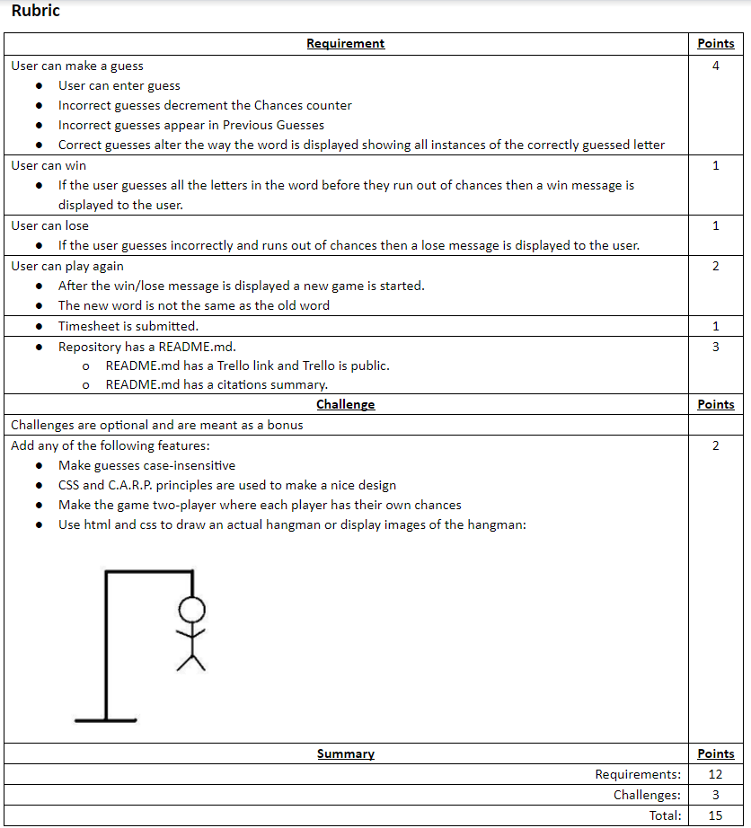

# HTML/CSS/JavaScript Hangman

# Introduction 
This assignment will be challenging for those of you who are new to JavaScript. Any project that involves game logic can be quite tricky because taking turns, and playing more than one round of a game will require loops inside of loops and that can add a lot of complexity to a project. This assignment will also require the use of at least one array to keep track of the words and a second array to keep track of the guessed letters. You will need to gather input and manipulate the DOM as well, so you can see that this assignment will be quite the challenge.

# Trello
https://trello.com/b/MS7rHL6E/js-hangman

# Rubric

# Citations
JavaScript Syntax:  
https://www.w3schools.com/

Code Review:  
Kyle Burz (Personal Friend)  